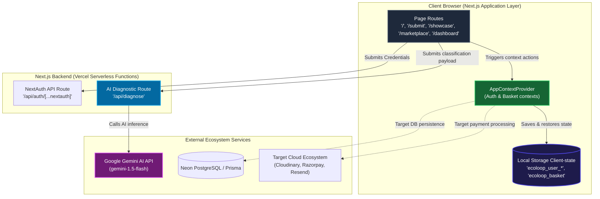
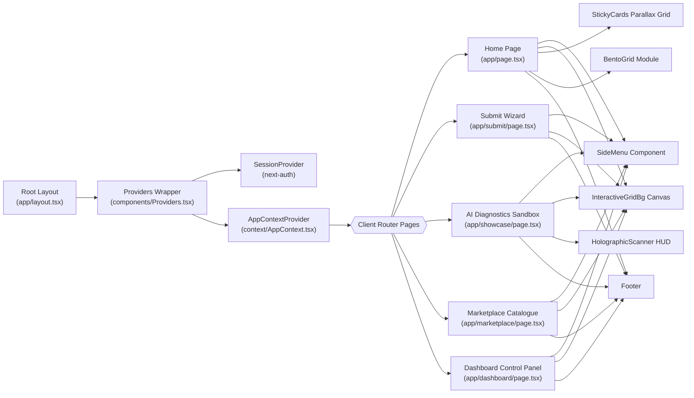
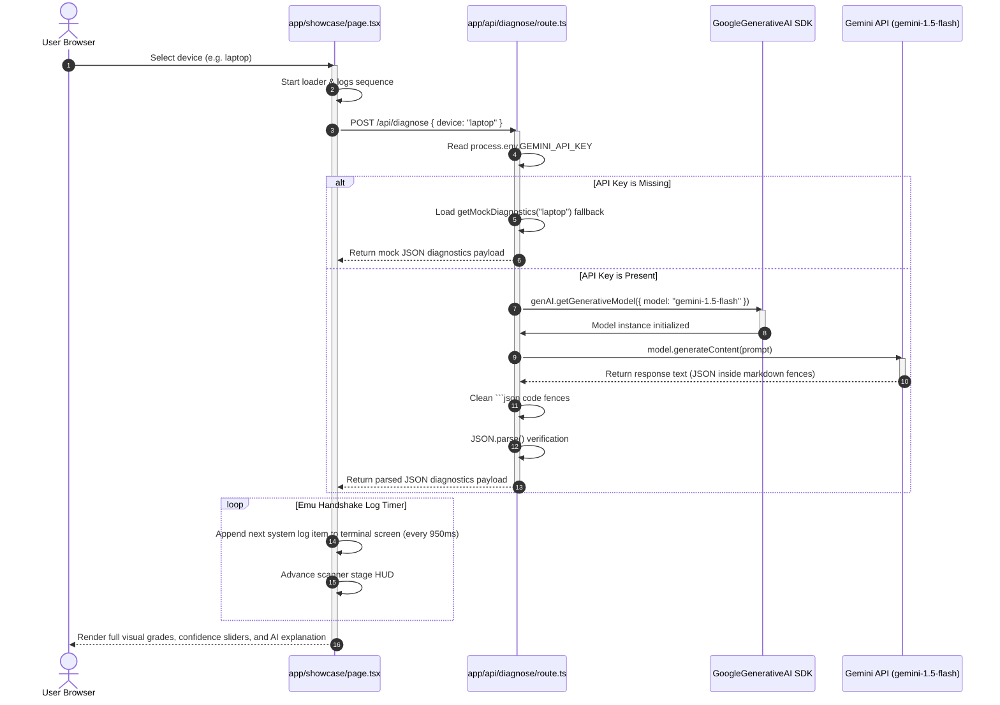
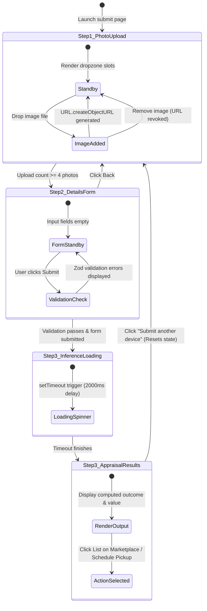
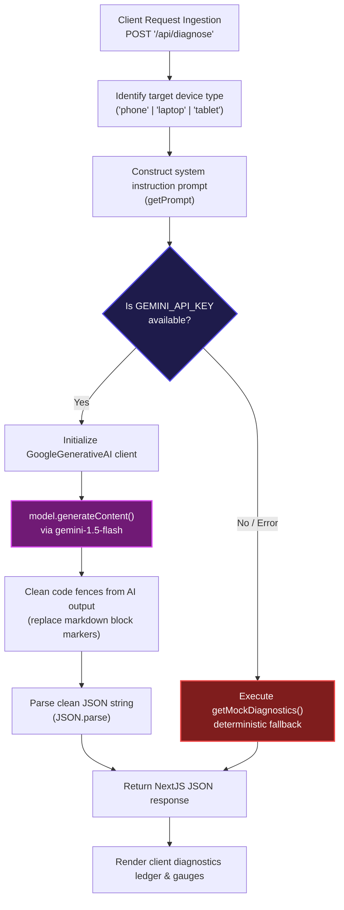
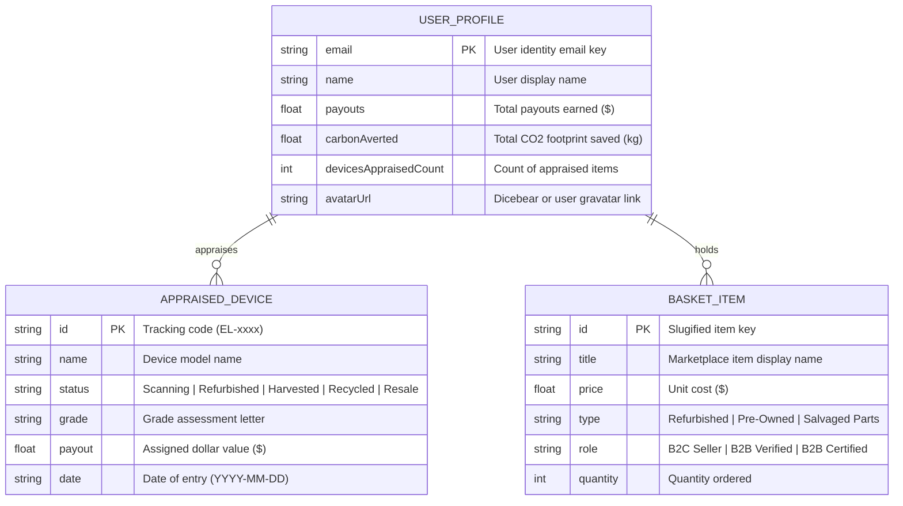
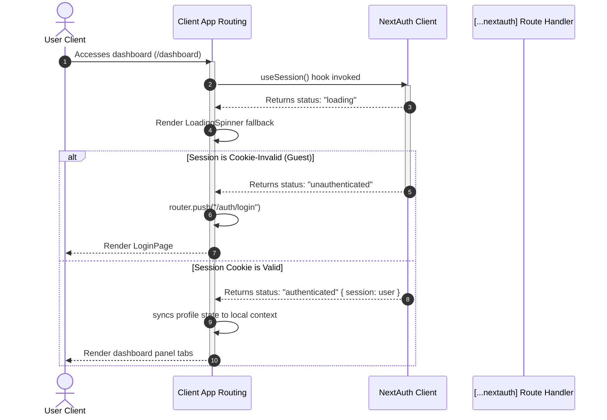
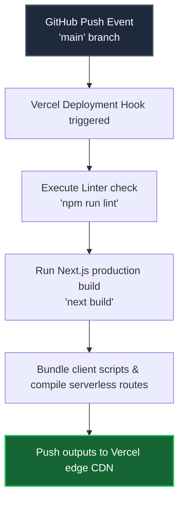

# 🌿 EcoLoop Workflow & Architecture Documentation

Welcome to the technical architectural specifications for **EcoLoop**, a circular e-waste orchestration platform designed to streamline electronic lifecycle optimization using AI-powered diagnostics.

---

### 🧭 1. Project Overview

**EcoLoop** is a full-stack web application designed to connect consumers, businesses, and certified recyclers in a carbon-negative circular economy for electronics. The platform automates device appraisal via a proprietary AI diagnostics engine, computes real-time pricing metrics, and logs transactions onto a secure simulation ledger. By categorizing device conditions into logical routing outcomes—**Refurbished**, **Resale**, **Harvested** (parts), and **Recycled**—EcoLoop ensures maximum value retrieval and environmental offset transparency.

#### Tech Stack Summary
| Layer | Technology | Purpose |
| :--- | :--- | :--- |
| **Framework** | **Next.js** 16 (App Router) | Core full-stack architecture, file-based page routing, and serverless API endpoints. |
| **Frontend Core** | **React** 19 | Client-side reactive rendering, page template rendering, and contextual state modules. |
| **Language** | **TypeScript** | Strict compile-time typing to enforce safety across APIs, props, and data structures. |
| **Styling** | **Tailwind CSS** + **Sass (SCSS)** | Design tokens, responsive utility-first layout structures, and isolated modular animation styles. |
| **Animations** | **GSAP** + **Framer Motion** | Parallax scroll triggers, 3D card tilt behaviors, entry staggers, and sliding drawer transitions. |
| **Interactive Canvas** | **HTML5 Canvas** API | Real-time particle grids, interactive ripple physics, and mouse spotlight effects. |
| **AI Integration** | **Google Gemini AI** SDK | Generative diagnostics and classification orchestration using the `gemini-1.5-flash` model. |
| **Auth Gateway** | **NextAuth.js** | JSON Web Token (**JWT**)-based credentials state machine and session orchestration. |
| **Validation** | **Zod** + **React Hook Form** | Safe client-side schema validation and state bindings for multi-step wizards. |
| **Scroll Engine** | **Lenis** | Custom smooth scrolling for seamless high-framerate parallax experiences. |
| **Database (Target)** | **PostgreSQL** via **Neon** | Relational data persistence layer for production deployment. |
| **ORM (Target)** | **Prisma** | Database migrations and relational mapping abstraction. |
| **Payments (Target)**| **Razorpay** | Secure transaction and bank checkout gateways. |
| **Email (Target)** | **Resend** | Automated receipt dispatching and certificate routing. |
| **Storage (Target)** | **Cloudinary** | Cloud-hosted hardware image asset repository. |

#### Key Goals & Design Principles
1. **Visual Excellence & High Aesthetics:** Sleek, dark mode glassmorphic interfaces punctuated by micro-interactions, canvas-driven graphics, and GSAP fanning layouts to drive user trust.
2. **Resilience & Fault Tolerance:** Graceful, compile-safe fallbacks for crucial API resources (such as Google Gemini AI or PostgreSQL connections) ensuring the application remains fully functional even in local environment isolation.
3. **Circular Loop Transparency:** Presenting clear, auditable calculations for ESG metrics (such as $CO_2$ averted in kilograms and payouts earned) on every dashboard and submission summary.

---

### 🗺️ 2. High-Level Architecture Diagram

The diagram below illustrates the routing relationships between client-side routes, global contexts, Next.js serverless functions, and external AI services, alongside target production interfaces.



---

### 🔄 3. Full End-to-End Flow (Step-by-Step)

The list below documents the background processes triggered by user actions across the app routes.

<details>
<summary><b>Flow 1: User Login (Credentials-Based NextAuth Session Sync)</b></summary>

1. **User Submission:** The user fills the email and password fields on `app/auth/login/page.tsx` and clicks "Sign In".
2. **Schema Checking:** The local client validates parameters via regular expression controls.
3. **API Dispatch:** The page executes the `login()` helper inside `context/AppContext.tsx`, which triggers a NextAuth login routine pointing to `/api/auth/[...nextauth]`.
4. **JWT Verification:** `CredentialsProvider` on the backend route (`app/api/auth/[...nextauth]/route.ts`) checks if the credentials exist and if the password is at least 6 characters. If successful, it constructs a user object containing:
   - A deterministic ID: `credentials.email.toLowerCase().replace(/[^a-z0-9]/g, "-")`
   - An avatar URL: `https://api.dicebear.com/7.x/bottts/svg?seed=${email}`
5. **Session Creation:** NextAuth returns a signed **JWT** token which the browser stores in its session cookies.
6. **State Sync & Profile Load:** `AppContextProvider` observes the session change (`status === "authenticated"`). It queries `localStorage` for `ecoloop_user_${email}`:
   - **If profile exists:** It parses and initializes the `user` state.
   - **If profile is new:** It creates a fresh profile structure, checks if it matches the default developer account (`sayan@ecoloop.ai`), and writes it to `localStorage`.
7. **Redirection:** The user is redirected to `app/dashboard/page.tsx`.

</details>

<details>
<summary><b>Flow 2: Sandbox AI Diagnostics (Showcase Page Simulation)</b></summary>

1. **Profile Selection:** On `app/showcase/page.tsx`, the user toggles between "phone", "laptop", or "tablet" profiles.
2. ** Handshake Initialization:** The client resets the scanning state variables (`scanStep = 0`) and populates the console output array with connection handshakes.
3. **API Post:** The page dispatches an asynchronous `POST` request to `/api/diagnose` containing the selected device type in the JSON body.
4. **Environment API Check:** On the server, `app/api/diagnose/route.ts` captures the body parameter and checks for the environment variable `GEMINI_API_KEY`:
   - **If Key Exists:** It instantiates the Google Generative AI client using `GoogleGenerativeAI(apiKey)`. It requests the model `gemini-1.5-flash` and constructs a structured system instruction prompt detailing the component slots (screen, battery, camera, chassis) and JSON structure rules.
   - **If Key is Missing / Fails:** It triggers the mock diagnostic engine `getMockDiagnostics(device)` to safely return structured hardware states instantly.
5. **AI Inference & JSON Parsing:** The Gemini model generates a response. The API route cleans markdown fences (` ```json `), parses the raw string to verify it is valid JSON, and returns the response payload.
6. **Handshake Console Emulation:** The client page receives the JSON payload. An interval timer appends diagnostic step logs (e.g. screen check, power state validation, chassis scuffs) every 950ms to simulate live scanning progress.
7. **Results Render:** Once all steps finish, the dashboard reveals the locked routing outcome, detailed diagnostic grades, and confidence sliders for Refurbish, P2P Resale, Parts Harvest, and Recycling.

</details>

<details>
<summary><b>Flow 3: Wizard Device Appraisal Submission (Submit Page)</b></summary>

1. **Image Dropzone Capture:** On `app/submit/page.tsx`, the user uploads 4-5 hardware photos (Front, Back, Left, Right, Damage Detail) using **React Dropzone**. Local blob URLs are generated via `URL.createObjectURL(file)` to display responsive previews.
2. **Form Step Transitions:** Once $\ge 4$ photos are uploaded, step 1 locks. The user proceeds to Step 2 to enter specifications: brand, model, purchase year, storage size, battery health %, screen wear, body condition details, functional checks, water exposure history, and included accessories.
3. **Validation & Submit:** Form input states are managed via **React Hook Form** and validated on submit against a strict **Zod** schema (`formSchema`). If validation passes, the wizard navigates to Step 3.
4. **Rule Engine Inference:** The page runs local diagnostic heuristics based on structural inputs:
   - **Recycle:** Triggered if `waterDamage === true` or screen condition is `shattered` or battery health $< 35\%$.
   - **Repair:** Triggered if screen is `cracked` or functional faults $> 2$ or battery health is between $35\%$ and $70\%$.
   - **Refurbish:** Triggered if screen has `minor_scratches` or battery health is between $70\%$ and $85\%$.
   - **Reuse:** Triggered if the device has zero damages and battery health $\ge 85\%$.
5. **ESG Metric Generation:** A mock ledger profile computes guaranteed cash payout values and secondary alternatives (e.g., precious metal extraction loops).
6. **Action Commitment:** The user can click "List on Marketplace" or "Schedule Pickup" to complete the e-waste lifecycle registration.

</details>

<details>
<summary><b>Flow 4: Sourcing Sourced Products (Marketplace & Cart Flows)</b></summary>

1. **Marketplace Sourcing:** On `app/marketplace/page.tsx`, the user views certified circular items (Refurbished iPhone 14 Pro, Pre-Owned Galaxy S23 Ultra, Reclaimed MacBook Air M2 Screen) and clicks "Source Item".
2. **Context Insertion:** The client dispatches the details to the `addItem` hook inside `useBasket()`.
3. **Cart Deduplication:** The context parses the pricing string, translates it to a numeric value, assigns a unique slugified ID, and updates the `items` state list (incrementing quantity if the item is already present).
4. **Local Storage Sync:** The new basket list stringifies and writes to `localStorage` key `ecoloop_basket`. A floating toast notification is triggered on the screen.
5. **Secure Checkout:** The user goes to the "Refurbished Basket" tab on their dashboard and clicks "Checkout Securely".
6. **Ledger Ledgering:** The basket triggers the asynchronous `checkout()` method, showing a loader for 1500ms (simulating payment verification). The basket state clears, the `ecoloop_basket` storage key is reset, and the user receives a simulated cryptographic ledger confirmation detailing a unique block ID.

</details>

<details>
<summary><b>Flow 5: Claiming Circular Wallet Payouts</b></summary>

1. **Balance Review:** On `app/dashboard/page.tsx`, the user views their total wallet payout balance under the "Circular Overview" tab.
2. **Initiate Claim:** The user clicks "Claim Circular Payout".
3. **State Release:** The dashboard fires a simulated releasing trigger, setting an `isClaiming` loader to `true`.
4. **Registry Update:** After a 1500ms timeout, the local transaction registry releases the payout. The profile state updates (setting wallet balance to $0.00$) and saves to `localStorage` under `ecoloop_user_${email}`. A success popup confirms that funds have been routed to the user's digital account.

</details>

---

### 🧩 4. Component-Level Diagrams

The component layouts, interactions, states, and schemas are visualized below.

#### Component Hierarchy Tree (`flowchart LR`)
This diagram outlines the routing tree and how shared components are injected across pages.



#### Diagnostic API Sequence Diagram (`sequenceDiagram`)
This diagram maps the communication cycle between the sandbox playground, the Next.js endpoint, and the Google Gemini AI APIs.



#### Submission Wizard UI State Machine (`stateDiagram-v2`)
This diagram represents the step transitions inside the multi-stage device submission wizard.



---

### 🤖 5. ML Pipeline & Real-Time Diagnostics Breakdown

While EcoLoop's codebase does not feature a Python training pipeline (`.ipynb`), it utilizes a real-time **Google Gemini AI** LLM-based zero-shot diagnostics pipeline to analyze device telemetry and generate structured assessments.



#### Real-Time Diagnostics System Prompt Specifications
* **Role:** Expert AI hardware diagnostics classifier for circular electronics at EcoLoop.
* **Target Inputs:** Physical state prompts covering `screen` (delamination, dead pixels), `battery` (capacity, swelling), `camera` (lenses, alignment), and `chassis` (dents, bent frame).
* **Expected Output Format:** Raw JSON payload (no wrapping code fences) matching the schema:
```json
{
  "name": "Model Specification",
  "grade": "Grade Category Letter",
  "diagnostics": {
    "screen": "Assessment text",
    "battery": "Assessment text",
    "camera": "Assessment text",
    "chassis": "Assessment text"
  },
  "outcome": "Refurbished | Harvested | Recycled | Resale",
  "confidences": { "refurbish": 85, "resale": 10, "salvage": 5, "recycle": 0 },
  "explanation": "Technical circular justification"
}
```

---

### 🌐 6. API Reference

All backend endpoints detected in the codebase are detailed below.

| Method | Route | Auth Required | Input | Output | Side Effects / Fallbacks |
| :--- | :--- | :---: | :--- | :--- | :--- |
| **POST** | `/api/diagnose` | No | `{ device: "phone" \| "laptop" \| "tablet" }` | Structured JSON diagnostics payload detailing grades, confidence vectors, and routing choices. | Calls Google Gemini API. If the server lacks `GEMINI_API_KEY` or the API request fails, it invokes the local mock database response engine. |
| **GET** | `/api/auth/[...nextauth]` | No | Query parameters managed by NextAuth client. | Handshake session cookie or OAuth routing. | Validates NextAuth cookies. |
| **POST** | `/api/auth/[...nextauth]` | No | Request payloads managed by NextAuth. | Returns session token or user validation states. | Updates JWT auth cookies. |

---

### 🗄️ 7. Database / State Schema

The application manages data states dynamically in the user's browser using client context states synchronized with local storage keys. The ERD below represents the data models.



---

### ⚙️ 8. Background Processes & Side Effects

All background tasks, side effects, and simulation metrics running inside the codebase are detailed below.

| Process / Side Effect | Trigger | Frequency / Schedule | Outcome / Side Effect |
| :--- | :--- | :--- | :--- |
| **Live Ledger Feed Stream** | Page load on `/` | Every 3.5 seconds (Appends next item), Every 1 second (Increments log age) | Simulates continuous active circular transactions across Bangalore, Mumbai, etc., updating local page lists. |
| **Local Storage Synchronization** | State modifications inside `AppContext.tsx` | Run instantly on changes to `user` profile or `basket` items | Serializes and writes state models directly to browser LocalStorage keys (`ecoloop_basket`, `ecoloop_user_${email}`). |
| **NextAuth Client Session Sync** | Change in auth cookie states | On session state change | `AppContextProvider` triggers profile updates, mapping email schemas to local storage entities. |
| **AI Diagnostics Simulation** | Changes to active profile selection on `/showcase` | Immediately upon toggling device selection | Triggers real-time fetching from server `/api/diagnose`. Emulates log handshakes step-by-step. |

---

### 🔐 9. Auth & Security Flow

NextAuth orchestration manages authentication states, utilizing JSON Web Tokens (**JWT**) as the primary session storage strategy.

#### Auth Authentication Cycle


#### Protected Routes and Authorization Policies
The codebase implements path guards inside client page components to restrict unauthenticated access.
* **Guarded Page:** `app/dashboard/page.tsx`
* **Guard Logic:** It checks `isAuthenticated` and `isLoading` states. If the session returns empty once loading finishes, the page calls `router.push("/auth/login")` to force credentials input.
* **Credentials Policy:** The CredentialsProvider authorizer logic inside `app/api/auth/[...nextauth]/route.ts` permits any login attempt as long as the email is in a valid format and the password length contains $\ge 6$ characters.

---

### 🚀 10. Deployment & Environment

The platform runs on **Vercel** serverless environments, deploying client pages and API routes as serverless edge microservices.

#### Environment Variables Configuration
| Environment Variable | Category | Required | Purpose |
| :--- | :--- | :---: | :--- |
| `GEMINI_API_KEY` | Generative AI | No (Highly Recommended) | Google AI token used to query Gemini models for device diagnostics. If missing, the route defaults to local mock evaluations. |
| `NEXTAUTH_SECRET` | Authentication | Yes | Key used to sign NextAuth session JWT tokens. |
| `NEXTAUTH_URL` | Authentication | Yes | The deployment base URL (e.g. `http://localhost:3000` or `https://ecoloop.vercel.app`). |
| `DATABASE_URL` | Relational Persistence | No (Target Production) | Neon PostgreSQL pooled connection string. |
| `DIRECT_URL` | Database Migration | No (Target Production) | Neon direct postgres connection string (bypassing connection poolers for schema migration). |

#### Target Vercel CI/CD Build Pipeline


---

### 🧠 11. Developer Mental Model

To successfully develop on the EcoLoop codebase, keep these structural paradigms in mind.

#### The 3 Most Important Files to Understand
1. **[AppContext.tsx](file:///Users/ritavas/Desktop/Frontend/EcoLoop/context/AppContext.tsx):** The state engine of the application. It manages authentication flows, synchronizes profile statistics ($CO_2$ saved, wallet balances), and handles the marketplace cart logic. Any state modifications must register here to persist in `localStorage`.
2. **[route.ts](file:///Users/ritavas/Desktop/Frontend/EcoLoop/app/api/diagnose/route.ts):** The backend interface orchestration file. It compiles prompt structures, queries the Gemini models, sanitizes output text blocks, and manages fallbacks if the API key is not present.
3. **[submit/page.tsx](file:///Users/ritavas/Desktop/Frontend/EcoLoop/app/submit/page.tsx):** The primary user workflow page. It coordinates image ingestion slots, tracks user input configurations, runs diagnostic scoring rules, and routes components dynamically.

#### The Most Common Data Flow (80% of Transactions)
The primary data flow starts on a user submission page, calculates state updates, and renders the result in the user's dashboard:
```
[User Forms Input] ──> [submit/page.tsx local diagnostic engine] ──> [AppContext.addAppraisedDevice()] ──> [Serialize JSON state] ──> [localStorage.setItem()] ──> [dashboard/page.tsx loads updated context]
```

#### Key Gotchas & Architectural Decisions
* **Local Storage Persistence vs. Live Database:** Despite references to Prisma and Neon Postgres in the `README.md`, the actual codebase operates on client-side state hooks synchronized with LocalStorage keys. This layout allows for seamless front-end prototyping, and can be extended to support production databases by replacing the state methods in `AppContext.tsx` with remote API calls.
* **NextAuth Dummy Credentials Provider:** The login system accepts any credentials with a password length $\ge 6$ characters. This is intentionally designed to allow developers and reviewers to access the dashboard and test the platform immediately without needing to configure database credentials.
* **Cleaning Markdown Code Blocks:** Large Language Models (LLMs) often wrap JSON responses in markdown blocks (e.g., ` ```json ... ``` `). The backend handler in `app/api/diagnose/route.ts` runs a regex match to remove code fences before calling `JSON.parse()`. If you modify the prompt structure, ensure the model output does not return wrapping brackets that break the parsing logic.
