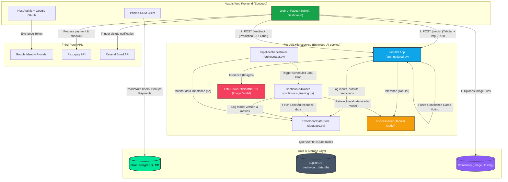
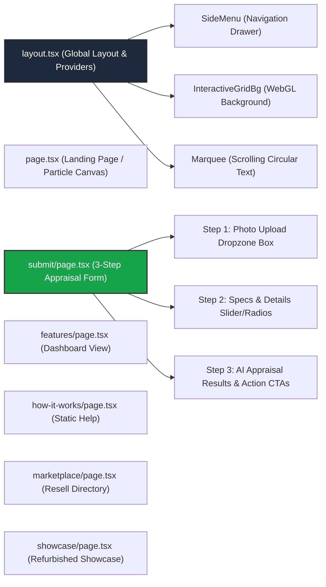
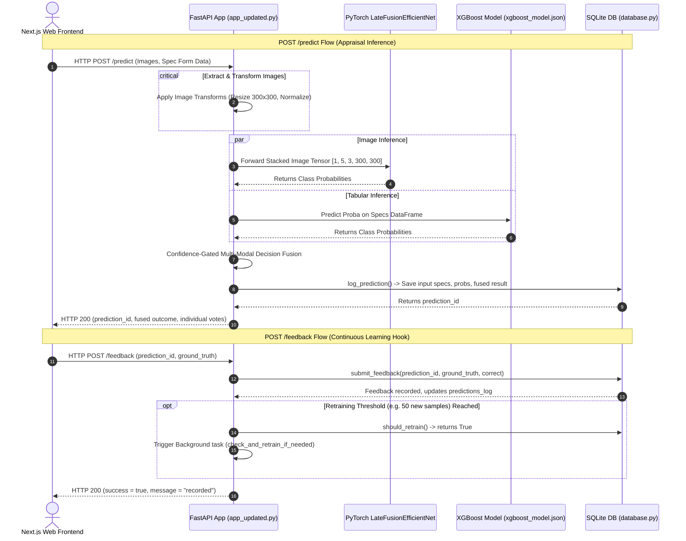
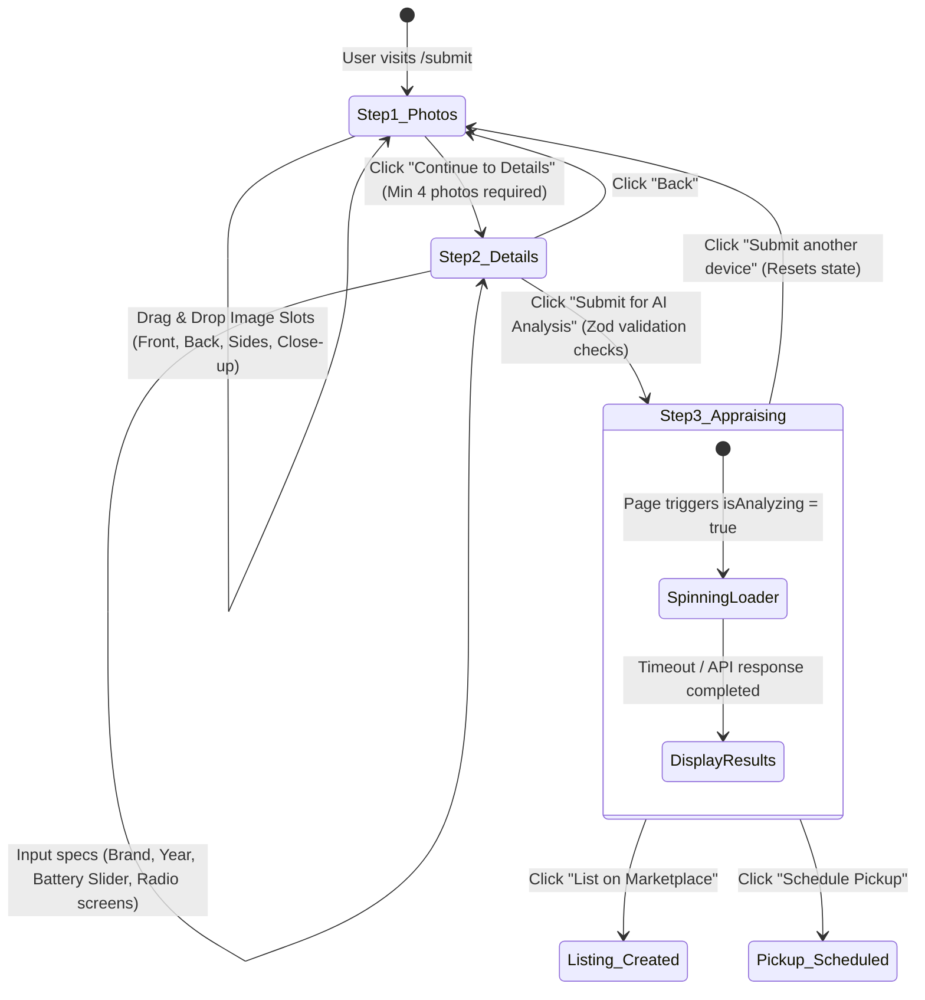
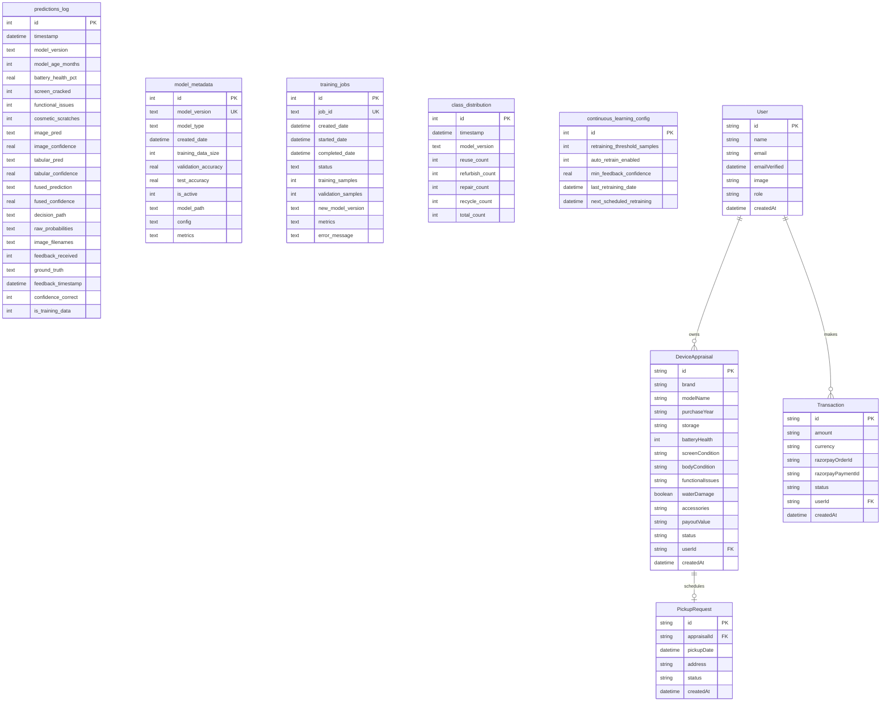
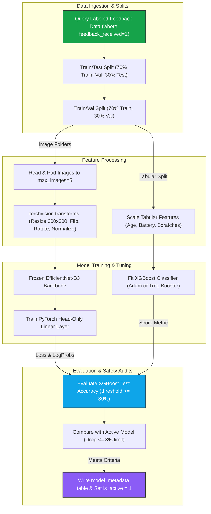
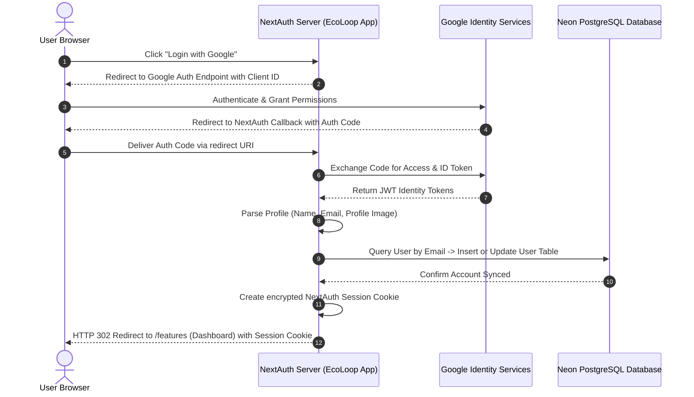
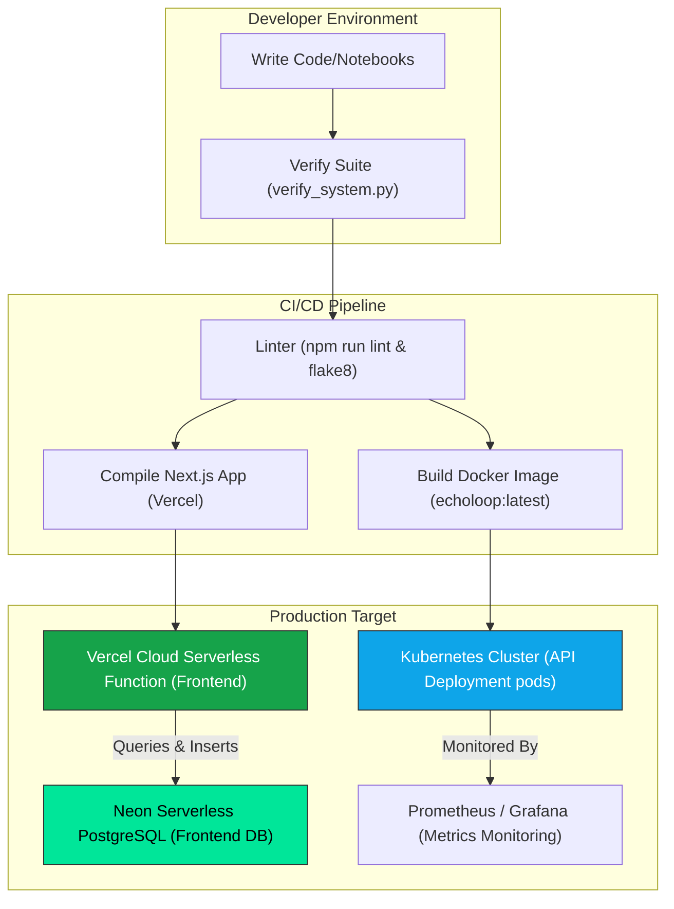

# ♻️ EcoLoop & Echoloop AI - Technical Architecture & Operational Blueprint

This document details the complete end-to-end architecture, API layers, continuous retraining pipelines, user flows, database structures, and development mental models for **EcoLoop** (Next.js frontend app) and **Echoloop AI** (FastAPI backend service).

---

### 🧭 1. Project Overview

**EcoLoop** is a full-stack, AI-powered circular e-waste management platform that connects consumers, businesses, and certified recyclers. By utilizing computer vision and tabular hardware telemetry, the platform automatically appraisals the condition grade of mobile phones and directs them to the optimal circular pathway (**Reuse**, **Refurbish**, **Repair**, or **Recycle**) while providing immediate payouts. 

#### Tech Stack Summary
| Layer | Technology | Purpose |
|:---|:---|:---|
| **Web Frontend** | **Next.js 15 (App Router)** | Server-side rendering (SSR), dynamic page layouts, routing, client state. |
| **Frontend Style** | **Tailwind CSS** | Custom theme configurations, cyberpunk dark aesthetics, responsive layouts. |
| **Auth Provider** | **NextAuth.js + Google OAuth** | Secure third-party identity federation, session token validation, RBAC. |
| **Payment Gateway** | **Razorpay API** | Secure transaction processing for device buyouts and marketplace listings. |
| **Notifications** | **Resend Email API** | Transaction confirmations, pickup scheduling updates, alerts. |
| **Image Hosting** | **Cloudinary** | Decentralized, high-performance image storage for device photos. |
| **Core Database** | **Neon PostgreSQL** | Serverless relational database for users, appraisals, payouts, and listings. |
| **ORM** | **Prisma** | Database migrations and programmatic type-safe queries on Neon. |
| **ML Backend** | **FastAPI + Uvicorn** | REST API endpoints for late-fusion prediction, feedback, and training. |
| **Inference Engine** | **PyTorch & XGBoost** | EfficientNet-B3 multi-image classifier fused with XGBoost tabular spec model. |
| **RAG/Pipeline DB** | **SQLite (echoloop_data.db)** | Embedded data store for predictions log, job telemetry, and model metadata. |
| **Continuous Learning**| **schedule (Python Library)** | Automatic model retraining workers and class distribution monitoring. |
| **ML Development** | **TensorFlow 2.x / Keras** | MobileNetV2 defect detection transfer learning and export pipelines. |

#### Key Goals & Design Principles
- **Maximize Circular Value**: Automatically direct hardware to its highest-value lifecycle state: direct peer-to-peer reuse, minor refurbishment, component harvesting, or mineral extraction.
- **Continuous Learning Loop**: Every prediction registers a feedback vector. When enough human ground-truth labels are collected, the system retrains itself, compares metrics, and hot-deploys without downtime.
- **Premium Cybersecurity Dark Aesthetics**: Render interactive components using WebGL canvas, particle funnels, neon color tokens (`#16a34a` emerald green), and framer-motion micro-interactions.

---

### 🗺️ 2. High-Level Architecture Diagram



---

### 🔄 3. Full End-to-End Flow (Step-by-Step)

<details>
<summary><b>Flow 1: User Submits Device for Appraisal & Multi-Modal Inference</b></summary>

1. **User interaction**: User navigates to `submit/page.tsx` and drops 4 or 5 images into the react-dropzone box component.
2. **Cloudinary upload**: Images are immediately uploaded client-side to Cloudinary. Secure URLs are returned and stored in the react-hook-form state.
3. **Specification input**: User updates battery health (slider), screen cracked status, cosmetic scratches level, age in months, and functional issues.
4. **API Invocation**: Next.js calls `POST http://localhost:8000/predict` with the specs form data and Cloudinary image URLs.
5. **FastAPI Processing**: 
   - Image transforms (`dataset.py:get_transforms()`) resize images to 300x300 and normalize RGB channels.
   - Padded images stack to shape `[1, 5, 3, 300, 300]` and feed into `LateFusionEfficientNet-B3`.
   - Specifications dataframe builds shape `[1, 5]` and feeds into the `XGBoost` classifier.
6. **Multi-Modal Decision Fusion**: 
   - If image model output confidence $\ge 90\%$: override and select image prediction.
   - If tabular model output confidence $\ge 90\%$: override and select tabular prediction.
   - If both $\ge 90\%$: select the highest confidence probability.
   - Else: compute soft weighted average probability ($60\%$ image model probability + $40\%$ tabular model probability).
7. **Database logging**: API calls `ECholooopDataStore.log_prediction()`, creating a record in SQLite `predictions_log` with all inputs, individual scores, fused probabilities, and `decision_path`.
8. **UI Rendering**: Returns payload containing `prediction_id`, decision breakdown, and circular grade. Next.js updates page state to render the appraisal card with payout valuations.
</details>

<details>
<summary><b>Flow 2: Submitting Ground-Truth Feedback & Retraining Trigger</b></summary>

1. **Feedback trigger**: A customer service agent or automated tester audits the device at check-in. They submit the actual condition grade.
2. **API Invocation**: A POST request is sent to `http://localhost:8000/feedback` with body `{ "prediction_id": 104, "ground_truth": "Repair" }`.
3. **Database update**: `submit_feedback()` updates `predictions_log` by setting `feedback_received = 1`, `ground_truth = "Repair"`, and `feedback_timestamp = CURRENT_TIMESTAMP`.
4. **Threshold check**: FastAPI queries `should_retrain(threshold_samples=50)`. If total un-trained feedback rows $\ge 50$, a background execution is spawned.
5. **Background execution**: `background_tasks.add_task(check_and_retrain_if_needed, 50)` is executed, freeing the API thread to return HTTP 200 response immediately.
</details>

<details>
<summary><b>Flow 3: Automatic Background Retraining & Deployment</b></summary>

1. **Task start**: `ContinuousTrainer.retrain_pipeline()` generates a unique version tag (e.g. `v1_retrain_20260603_094500_ab12cd34`) and sets the job status to `STARTED` in the `training_jobs` table.
2. **Splitting data**: Fetch all feedback-labeled records. Split datasets into $70\%$ train, $10\%$ validation, and $20\%$ test.
3. **Tabular training**: Retrain the `XGBoost` model using the current dataset and log loss metrics.
4. **Evaluation**: Compute model accuracy on the test split.
5. **Model serialization**: Save the new XGBoost model to `models/xgboost_v1_retrain_...json`.
6. **Deployment check**: The orchestrator checks safety criteria:
   - Is new test accuracy $\ge 80\%$?
   - Is performance drop compared to current active model $\le 3\%$?
7. **Hot swap**: If criteria are met, `set_active_model()` updates `model_metadata` setting the new model's `is_active = 1` and old model's `is_active = 0`. The API immediately starts routing new requests to the updated model json.
</details>

<details>
<summary><b>Flow 4: Scheduled Cron Jobs & Data Health Monitoring</b></summary>

1. **Daily Retrain (2:00 AM)**: The `PipelineOrchestrator` cron scheduler triggers the retraining job to capture all feedback logged during the day.
2. **Imbalance check (every 6 hours)**: The orchestrator runs `monitor_data_distribution()`.
3. **Distribution Audit**: Queries the SQLite database for prediction distributions over the last 7 days.
4. **Alert Trigger**: Calculates the ratio of the majority class count to the minority class count. If this ratio exceeds `max_class_ratio` ($3.0$), it throws a system warning: `Data imbalance detected! Ratio: X.XX` to log files, alerting administrators to adjust marketing payouts to stabilize feedstock categories.
</details>

---

### 🧩 4. Component-Level Diagrams

#### Component Hierarchy (EcoLoop Frontend Pages)


#### API Request/Response Lifecycle (FastAPI Core)


#### UI State Machine (Form Navigation)


#### Database Schema ERD


---

### 🤖 5. ML Pipeline Breakdown

The machine learning system is split into two pipelines:
1. An offline computer vision classification model (`01_Defect_Detection.ipynb`) using TensorFlow/Keras to classify image defects into `cracked_screen`, `oil`, `scratch`, and `stain`.
2. A production continuous retraining pipeline (`continuous_training.py` + `model.py`) using PyTorch and XGBoost to predict the final circular outcome grade (`Reuse`, `Refurbish`, `Repair`, or `Recycle`).



#### Defect Detection Model (Phase 2 - 4-class)
- **Base Architecture**: **MobileNetV2** (weights pre-trained on ImageNet).
- **Head Layers**: `GlobalAveragePooling2D` $\rightarrow$ `Dense(256, activation='relu')` $\rightarrow$ `Dropout(0.3)` $\rightarrow$ `Dense(4, activation='softmax')`.
- **Target classes**: `cracked_screen` (0), `oil` (1), `scratch` (2), `stain` (3). (Pristine classes are filtered out to improve segmentation focus).
- **Metrics Tracked**: Categorical Crossentropy Loss, Test Accuracy, Class-specific Precision, Recall, and F1-Scores.
- **Export Format**: Native Keras Archive format (`phone_defect_detector_v2.keras`).

#### Retraining Hyperparameters (XGBoost Tabular Model)
| Parameter | Value | Effect |
|:---|:---|:---|
| `n_estimators` | 100 (Default) / 80 (Base) | Limits number of gradient boosted trees; prevents over-parametrization on small datasets. |
| `max_depth` | 6 (Default) / 4 (Base) | Determines maximum depth of a tree. Higher values capture deep feature interaction but increase overfitting risk. |
| `learning_rate` | 0.1 | Step size shrinkage used in update to prevent overshoot during boosting steps. |
| `subsample` | 0.8 | Ratio of training instances sample randomly per boosting round to reduce variance. |
| `colsample_bytree` | 0.8 | Subsample ratio of columns when constructing each tree. |
| `eval_metric` | `mlogloss` | Multiclass logloss used to score model convergence during training. |

---

### 🌐 6. API Reference

| Method | Route | Auth Required | Input | Output (JSON) | Side Effects / Background Jobs |
|:---|:---|:---|:---|:---|:---|
| **POST** | `/predict` | No | Multi-part form data: `images` (List of UploadFile), `model_age_months` (int), `battery_health_pct` (float), `screen_cracked` (bool), `functional_issues` (bool), `cosmetic_scratches` (int). | `{ "prediction_id": int, "prediction": str, "confidence_pct": float, ... }` | Logs prediction request data directly into SQLite table `predictions_log`. |
| **POST** | `/feedback` | No | `{ "prediction_id": int, "ground_truth": str }` | `{ "success": bool, "message": str }` | Updates SQLite record; if new feedback samples count $\ge 50$, triggers background retraining job. |
| **GET** | `/model/status` | No | None | `{ "active_model_version": str, "accuracy_test": float, "retraining_required": bool, ... }` | Queries SQLite `model_metadata` and checks if new labeled data threshold has been reached. |
| **POST** | `/retrain` | No | None | `{ "success": bool, "message": str }` | Manually triggers background thread executing the complete XGBoost retraining pipeline. |
| **GET** | `/predictions/pending-feedback` | No | Query: `limit` (int, default=20) | `{ "count": int, "predictions": [...] }` | Queries SQLite for unfeedbacked predictions sorted chronologically. |
| **GET** | `/statistics` | No | None | `{ "class_distribution_7d": {...}, "class_distribution_30d": {...} }` | Processes SQLite predictions log to summarize feedback distributions. |
| **GET** | `/health` | No | None | `{ "status": "healthy", "device": str, "model_version": str }` | Returns system status uptime telemetry. |

---

### 🗄️ 7. Database / State Schema

The system utilizes two distinct databases: **SQLite** locally for the ML service registry and **Neon PostgreSQL** serverless in cloud staging/production for user management and transactions.

#### SQLite Datastore Schema (`echoloop_data.db`)

##### 1. `predictions_log`
- `id` (INTEGER PRIMARY KEY AUTOINCREMENT)
- `timestamp` (DATETIME DEFAULT CURRENT_TIMESTAMP)
- `model_version` (TEXT): Active version string during prediction.
- `model_age_months` (INTEGER): Input feature.
- `battery_health_pct` (REAL): Input feature.
- `screen_cracked` (INTEGER): Input feature (0/1).
- `functional_issues` (INTEGER): Input feature (0/1).
- `cosmetic_scratches` (INTEGER): Input feature.
- `image_pred` (TEXT): Classification from EfficientNet backbone.
- `image_confidence` (REAL): EfficientNet softmax score.
- `tabular_pred` (TEXT): Classification from XGBoost tabular model.
- `tabular_confidence` (REAL): XGBoost softmax score.
- `fused_prediction` (TEXT): Selected class output after decision fusion logic.
- `fused_confidence` (REAL): Selected final probability score.
- `decision_path` (TEXT): Identifies fusion route (e.g. `weighted_soft_voting`, `image_model_override_90%`).
- `raw_probabilities` (TEXT): JSON-serialized float distributions for all 4 classes.
- `image_filenames` (TEXT): JSON list of names of uploaded image files.
- `feedback_received` (INTEGER DEFAULT 0): Check flag for retraining query splits.
- `ground_truth` (TEXT): Real verified label supplied via user feedback.
- `feedback_timestamp` (DATETIME): Timestamp when feedback was submitted.
- `confidence_correct` (INTEGER): Flag showing if predicted output matched ground truth.
- `is_training_data` (INTEGER DEFAULT 0): Flag showing if record has already been consumed by retraining loop.

##### 2. `model_metadata`
- `id` (INTEGER PRIMARY KEY AUTOINCREMENT)
- `model_version` (TEXT UNIQUE): Model name tag.
- `model_type` (TEXT): Model architecture description (e.g., `xgboost`, `efficientnet_b3`).
- `created_date` (DATETIME): Compilation timestamp.
- `training_data_size` (INTEGER): Number of training records.
- `validation_accuracy` (REAL): Validation set performance.
- `test_accuracy` (REAL): Unseen test set accuracy performance.
- `is_active` (INTEGER DEFAULT 0): Flag showing if model is active for live routing.
- `model_path` (TEXT): File path to model checkpoint binary.
- `config` (TEXT): JSON configuration configuration data.
- `metrics` (TEXT): JSON containing metrics breakdown (e.g. precision, F1-scores).

---

### ⚙️ 8. Background Processes & Side Effects

```mermaid
block-beta
  columns 3
  A["FastAPI Thread (predict/feedback)"]
  space
  B["Orchestrator Process (CLI/schedule)"]

  A --> |"Threshold >= 50 (background task)"| RetrainThread["Background Retrain Worker"]
  B --> |"Daily 2 AM Cron"| RetrainThread
  B --> |"Hourly checks"| MonitorDist["Imbalance Monitor"]
  
  style A fill:#0ea5e9,color:#fff
  style B fill:#16a34a,color:#fff
  style RetrainThread fill:#8b5cf6,color:#fff
  style MonitorDist fill:#f59e0b,color:#fff
```

- **FastAPI Background Tasks**: When `/feedback` is hit and `should_retrain()` evaluates to true, FastAPI schedules `check_and_retrain_if_needed()` in a separate thread. This processes training data, runs evaluations, and serializes the new XGBoost json without blocking incoming user prediction requests.
- **Daily Retraining Cron**: Defined in `orchestrator.py` via Python `schedule` library:
  ```python
  schedule.every().day.at("02:00").do(self.scheduled_retrain_job)
  ```
  This processes all user feedback collected during the day.
- **Class Imbalance Monitor**: Runs every 6 hours to compute feedback label distributions. If class ratios exceed thresholds, it logs warning flags to `./logs/orchestrator.log` to alert ML engineers of potential drift.
- **Model Inference Latency**: Targets for inference are set to $<500\text{ms}$ overall. PyTorch uses GPU support (`cuda` or `mps`) if available, but falls back to `cpu` mode where it utilizes core threading optimized for parallel matrix multiplication.

---

### 🔐 9. Auth & Security Flow

#### Authentication Strategy
- EcoLoop uses **NextAuth.js** configured with **Google Provider** client credentials. Session data is encrypted using JWT tokens stored as secure HTTP-only cookies to prevent XSS-based session hijacking.
- Static API endpoints on Next.js are guarded via `middleware.ts`. Users trying to access `/features` or `/submit` without a valid NextAuth session cookie are redirected back to the login interface.

#### Google OAuth Handshake Flow


---

### 🚀 10. Deployment & Environment

The frontend is deployed to **Vercel** serverless hosting, while the FastAPI service runs in a Docker container, managed via Docker Compose or Kubernetes configurations.

#### Environment Variables Config

| Environment Variable | Config Layer | Purpose | Required |
|:---|:---|:---|:---|
| `DATABASE_URL` | Frontend | Neon PostgreSQL pooler connection string. | **Yes** |
| `DIRECT_URL` | Frontend | Neon PostgreSQL direct connection string (Prisma migrate). | **Yes** |
| `NEXTAUTH_SECRET` | Frontend | Encryption key for signing NextAuth JWT cookies. | **Yes** |
| `GOOGLE_CLIENT_ID` | Frontend | OAuth application identifier from Google Console. | **Yes** |
| `GOOGLE_CLIENT_SECRET` | Frontend | Secret key corresponding to the OAuth client ID. | **Yes** |
| `RAZORPAY_KEY_ID` | Frontend | Public Razorpay key used for UI widget loader. | **Yes** |
| `RAZORPAY_KEY_SECRET` | Frontend | Private secret for verifying webhook payloads. | **Yes** |
| `RESEND_API_KEY` | Frontend | Mailer key used for sending confirmation receipts. | **Yes** |
| `CLOUDINARY_CLOUD_NAME` | Frontend | Target Cloud name for media uploads. | **Yes** |
| `API_PORT` | Backend | Port binding for Uvicorn ASGI server (default 8000). | No |
| `MODEL_DEVICE` | Backend | Target compute device for PyTorch: `cuda`, `mps`, or `cpu`. | No |
| `RETRAINING_THRESHOLD` | Backend | Sample count to trigger background training runs. | No |

#### Deployment & CI/CD Pipeline


---

### 🧠 11. Developer Mental Model

#### The 3 Most Important Files to Understand
1. **[app_updated.py](file:///Users/ritavas/Desktop/Frontend/Echoloop-AI-service/app_updated.py)**: The API backbone. Defines endpoints, late-fusion prediction routing, and orchestrates the continuous retraining lifecycle thread triggers.
2. **[continuous_training.py](file:///Users/ritavas/Desktop/Frontend/Echoloop-AI-service/continuous_training.py)**: The MLOps pipeline coordinator. Manages fetching SQLite feedback inputs, preprocessing, validation splitting, model training, evaluation metrics comparison, and hot-swapping serialization.
3. **[submit/page.tsx](file:///Users/ritavas/Desktop/Frontend/EcoLoop/app/submit/page.tsx)**: The frontend user interface for device appraisal, photo upload layout slots, and Zod form schemas that align with backend endpoint requirements.

#### The 80% Path (Inference & Logging Core Flow)
```
[User Browser Dropzone] 
       │ (Images)
       ▼
[Cloudinary Server] ──► (URLs) ──► [Next.js formState]
                                          │ (POST /predict)
                                          ▼
                                   [FastAPI Server] ──► [Torch: EfficientNet-B3]
                                                    ──► [XGBoost: Tabular Model]
                                                          │
                                                          ▼ (Fused Voting Decision)
                                                    [SQLite: predictions_log]
```
Over 80% of system interaction traverses this route. Understanding how raw image inputs are normalized, processed, and fused with tabular specs in `app_updated.py` is key to debugging regression or deployment latency.

#### Gotchas & Non-Obvious Decisions

> [!WARNING]
> **Apple Silicon PyTorch NaN Bug**: The PyTorch model training script (`train_model.py`) forces `device = torch.device('cpu')`. This was explicitly chosen to bypass unstable MPS (Metal Performance Shaders) Apple Silicon GPU float math operations, which occasionally compute `NaN` weights when backpropagating loss through the EfficientNet-B3 layer. Do not modify the device selector without verifying gradient stability.

> [!NOTE]
> **Confidence-Gated Overrides**: In `/predict`, if either model has confidence $\ge 90\%$, it overrides the soft-voting fusion scheme. This prevents soft-voting from washing out strong predictions (e.g. if the image model identifies a cracked screen with $98\%$ confidence, but tabular metadata predicts Reuse due to young age).

> [!IMPORTANT]
> **Schema Isolation**: The SQLite `echoloop_data.db` is purposefully separated from Neon PostgreSQL. It acts as an isolated sandbox for fast ML retraining queries, preventing heavy batch analytics runs from exhausting PostgreSQL database connection pools or impacting transaction latency.
